# Architecture Documentation

## System Architecture

### High-Level Architecture

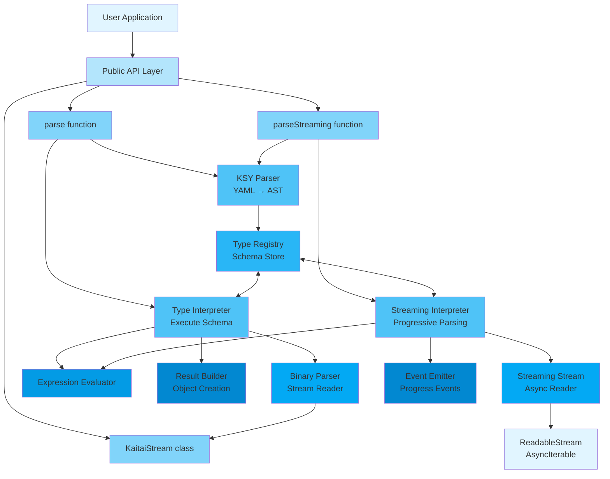

### Component Relationships

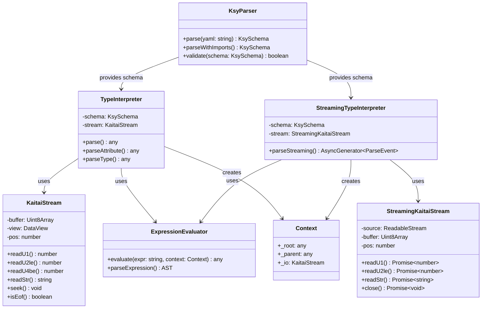

## Data Flow

### Parsing Flow

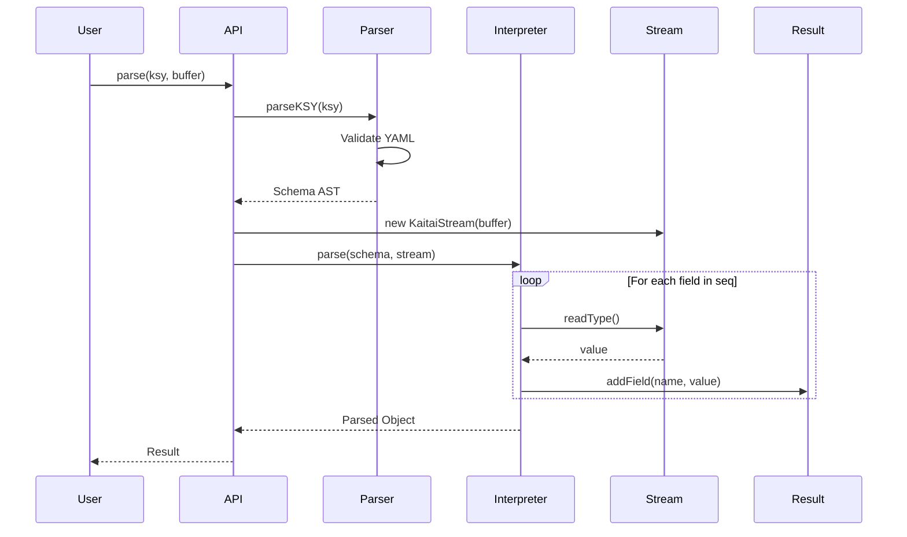

### Expression Evaluation Flow

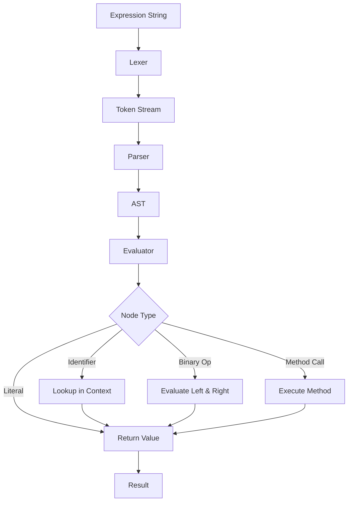

## Module Structure

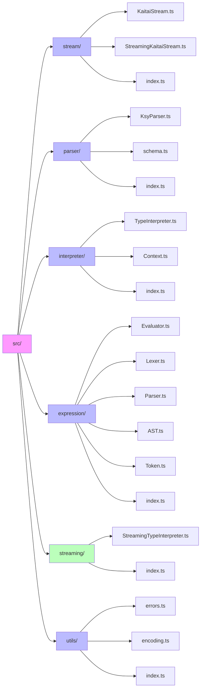

## Type System

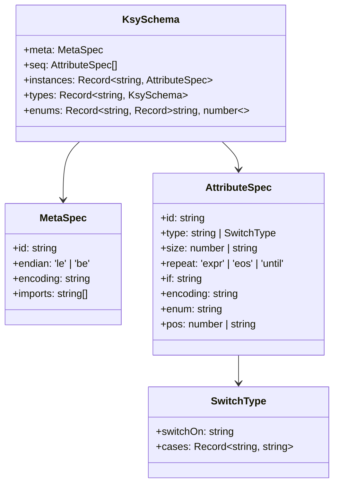

## State Management

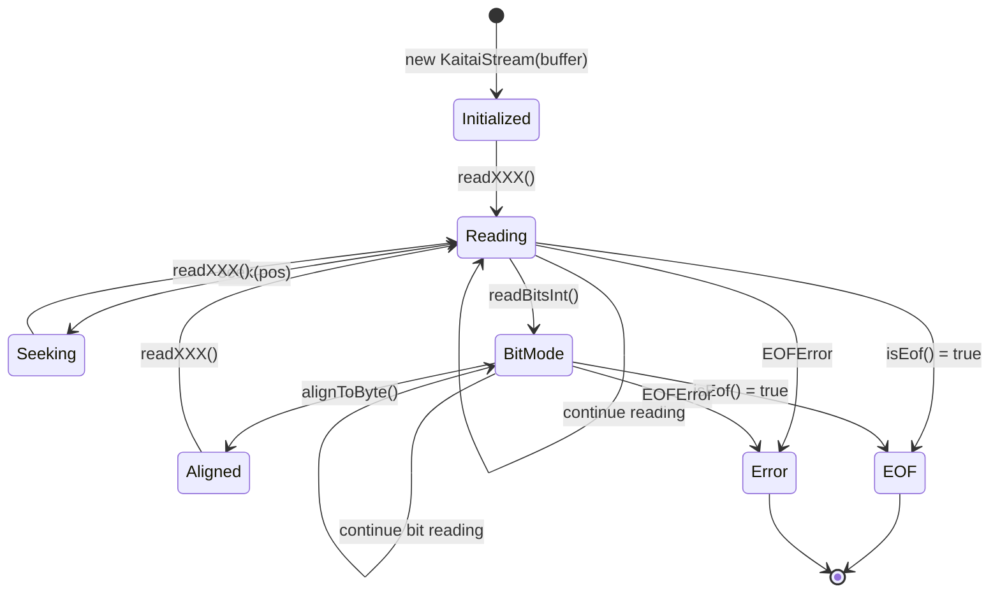

## Error Handling

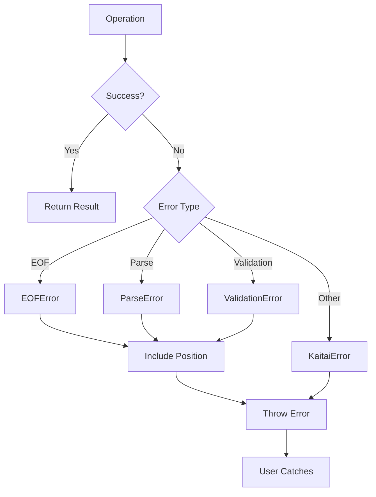

## Development Timeline

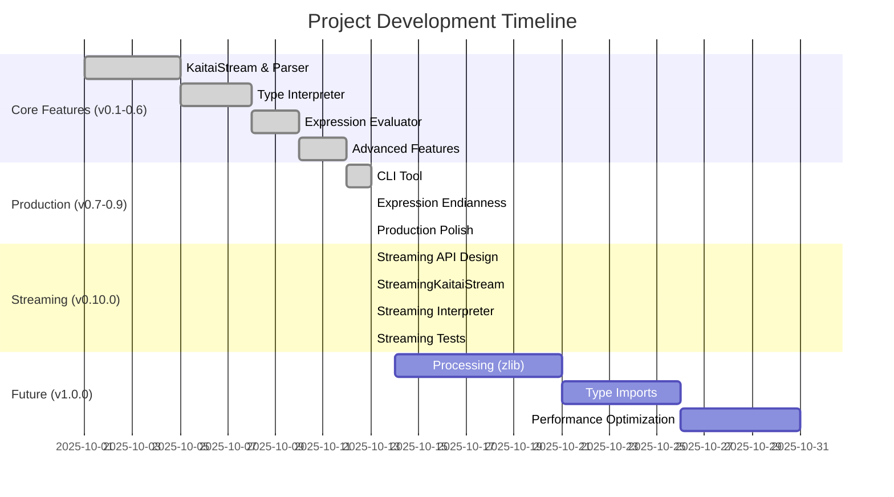

## Performance Considerations

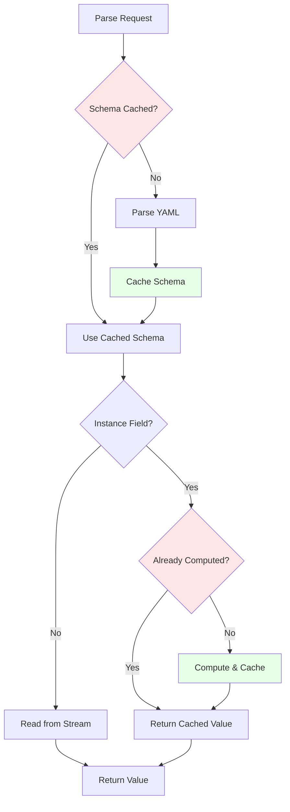

## Testing Strategy

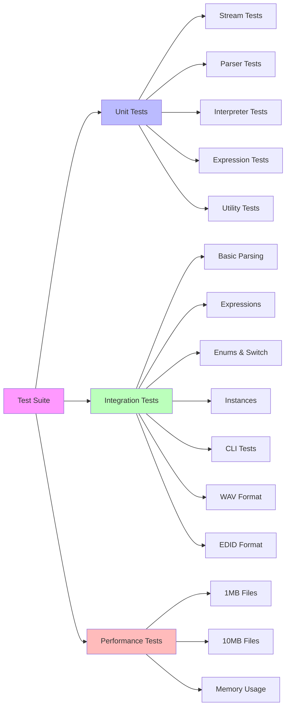
